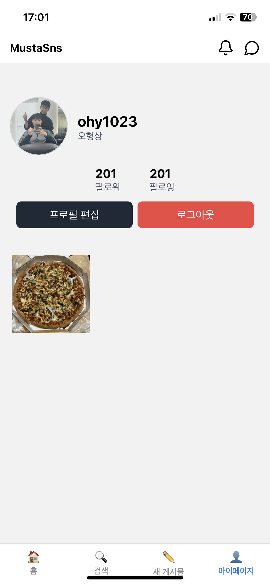

# mutsa-sns-fe

react-native expo를 활용한 mutsa-sns Front 개발

---

## 📸 화면 개발

## 9. 서비스 화면 (MOBILE) 📱

<table style="border: 2px; text-align:center;">
  <tr style="text-align:center;">
    <td> 로그인 </td>
    <td> 회원 가입 </td>
    <td> 마이페이지 </td>
  </tr>
  <tr>
    <td>
      
    </td>
    <td>
      
    </td>
    <td>
      
    </td>
  </tr>
</table>

 

<table style="border: 2px; text-align:center;">
  <tr style="text-align:center;">
    <td> 홈 화면 </td>
    <td> 회원 상세 </td>
    <td> 게시글 상세 </td>
  </tr>
  <tr>
    <td>
      
    </td>
    <td>
      
    </td>
    <td>
      
    </td>
  </tr>
</table>

<table style="border: 2px; text-align:center;">
  <tr style="text-align:center;">
    <td> 댓글 </td>
    <td> 채팅 리스트 </td>
    <td> 채팅 </td>
  </tr>
  <tr>
    <td>
      
    </td>
    <td>
      
    </td>
    <td>
      
    </td>
  </tr>
</table>

---

## 📦 기술 스택

- **프레임워크:** React Native (Expo)
- **언어:** TypeScript
- **내비게이션:** expo-router
- **UI 라이브러리:** Tailwind CSS

---
